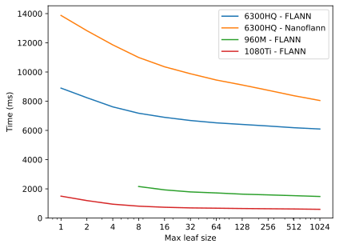

<head>
    <link rel="stylesheet" type="text/css" href="https://yasamoka.github.io/pcl-knn-benchmark/stylesheets/page.css"/>
</head>

# Full Comparison

------

## Configurations

#### Intel Core i5 6300HQ:

| **Parameter** | **Value** |
| Laptop | Dell XPS 15 9550 |
| RAM | 16GB DDR4-2133 (Dual Channel) |

------

#### Intel Core i7 5820K:

| **Parameter** | **Value** |
| Frequency | 4.3GHz |
| RAM | 32GB DDR4-2666 (Quad Channel) |

------

#### NVIDIA GeForce GTX 960M:

| **Parameter** | **Value** |
| Laptop | Dell XPS 15 9550 |

------

#### NVIDIA GeForce GTX 1080Ti:

| **Parameter** | **Value** |
| PCI-E Bus | 3.0 x16 |

## Benchmarks

### Build tree

| **Parameter** | **Value** |
| \# search points | 100,000 |

<a href="plots/build-tree/num_search_100000.svg">
    
</a>

| **Parameter** | **Value** |
| \# search points | 1,000,000 |

<a href="plots/build-tree/num_search_1000000.svg">
    
</a>

| **Parameter** | **Value** |
| \# search points | 10,000,000 |

<a href="plots/build-tree/num_search_10000000.svg">
    
</a>

### NN search

#### Best max leaf size

| **Parameter** | **Value** |
| \# query points | 100,000 |
| K | 1 |

##### Single-threaded:

<a href="plots/nn-search/bar/num_query_100000_k_1_st.svg">
    
</a>

##### Multi-threaded / CUDA:

<a href="plots/nn-search/bar/num_query_100000_k_1_mt_cuda.svg">
    
</a>

------

| **Parameter** | **Value** |
| \# query points | 1,000,000 |
| K | 1 |

##### Multi-threaded / CUDA:

<a href="plots/nn-search/bar/num_query_1000000_k_1_mt_cuda.svg">
    
</a>

## Generation

### Page (with plots)

```bash
PYTHONPATH=. python generate.py -n "Full Comparison" -s "Intel Core i5 6300HQ" -c ../../configs/xps_15_9550/6300hq.json -b ../../results/xps_15_9550/6300hq/ -s "Intel Core i7 5820K" -c ../../configs/desktop/5820k.json -b ../../results/desktop/5820k/ -s "NVIDIA GeForce GTX 960M" -c ../../configs/xps_15_9550/960m.json -b ../../results/xps_15_9550/960m/ -s "NVIDIA GeForce GTX 1080Ti" -c ../../configs/desktop/1080ti.json -b ../../results/desktop/1080ti/ -o ../../docs/comparisons/full-comparison/
```

### Plots
```shell
PYTHONPATH=. python plots/build_tree.py -b ../../results/xps_15_9550/6300hq/build_tree.csv -s "Intel Core i5 6300HQ" -b ../../results/desktop/5820k/build_tree.csv -s "Intel Core i7 5820K" -b ../../results/xps_15_9550/960m/build_tree.csv -s "NVIDIA GeForce GTX 960M" -b ../../results/desktop/1080ti/build_tree.csv -s "NVIDIA GeForce GTX 1080Ti"
PYTHONPATH=. python plots/nn_search.py -b ../../results/xps_15_9550/6300hq/nn_search.csv -s "Intel Core i5 6300HQ" -b ../../results/desktop/5820k/nn_search.csv -s "Intel Core i7 5820K" -b ../../results/xps_15_9550/960m/nn_search.csv -s "NVIDIA GeForce GTX 960M" -b ../../results/desktop/1080ti/nn_search.csv -s "NVIDIA GeForce GTX 1080Ti"
```
