<head>
    <link rel="stylesheet" type="text/css" href="https://yasamoka.github.io/pcl-knn-benchmark/stylesheets/page.css"/>
</head>

# Intel Core i7 5820K

------

## Configuration


| **Parameter** | **Value** |
| Frequency | 4.3GHz |
| RAM | 32GB DDR4-2666 (Quad Channel) |

## Benchmarks

### Build tree

| **Parameter** | **Value** |
| \# search points | 100,000 |

<a href="plots/build-tree/num_search_100000.svg">
    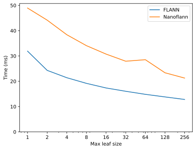
</a>

| **Parameter** | **Value** |
| \# search points | 1,000,000 |

<a href="plots/build-tree/num_search_1000000.svg">
    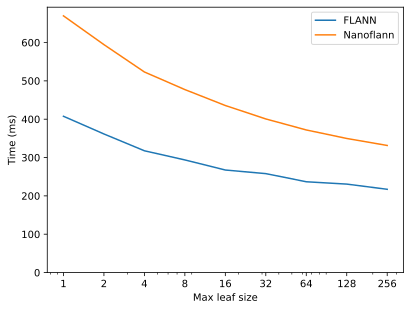
</a>

### NN search

#### Best max leaf size

| **Parameter** | **Value** |
| \# query points | 100,000 |
| K | 1 |

##### Single-threaded:

<a href="plots/nn-search/bar/num_query_100000_k_1_st.svg">
    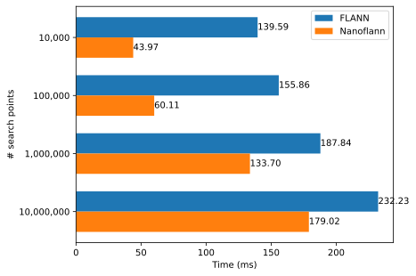
</a>

##### Multithreaded:

<a href="plots/nn-search/bar/num_query_100000_k_1_mt.svg">
    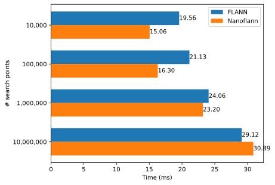
</a>

#### Detailed

| **Parameter** | **Value** |
| \# search points | 10,000 |
| \# query points | 100,000 |
| K | 1 |

##### Single-threaded:
<a href="plots/nn-search/line/num_search_10000_num_query_100000_k_1_st.svg">
    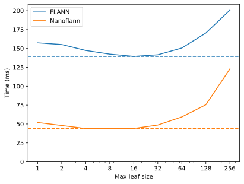
</a>
##### Multithreaded:
<a href="plots/nn-search/line/num_search_10000_num_query_100000_k_1_mt.svg">
    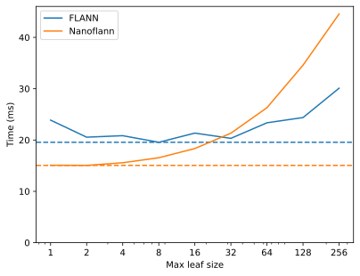
</a>

------

| **Parameter** | **Value** |
| \# search points | 100,000 |
| \# query points | 100,000 |
| K | 1 |

##### Single-threaded:
<a href="plots/nn-search/line/num_search_100000_num_query_100000_k_1_st.svg">
    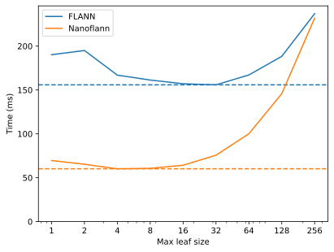
</a>
##### Multithreaded:
<a href="plots/nn-search/line/num_search_100000_num_query_100000_k_1_mt.svg">
    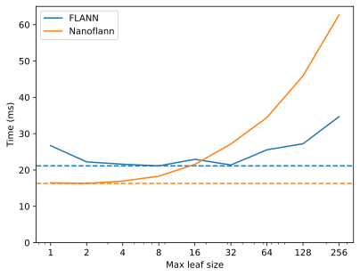
</a>

------

| **Parameter** | **Value** |
| \# search points | 1,000,000 |
| \# query points | 100,000 |
| K | 1 |

##### Single-threaded:
<a href="plots/nn-search/line/num_search_1000000_num_query_100000_k_1_st.svg">
    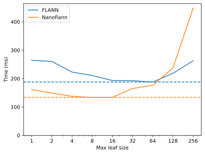
</a>
##### Multithreaded:
<a href="plots/nn-search/line/num_search_1000000_num_query_100000_k_1_mt.svg">
    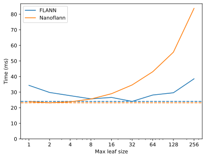
</a>

------

| **Parameter** | **Value** |
| \# search points | 10,000,000 |
| \# query points | 100,000 |
| K | 1 |

##### Single-threaded:
<a href="plots/nn-search/line/num_search_10000000_num_query_100000_k_1_st.svg">
    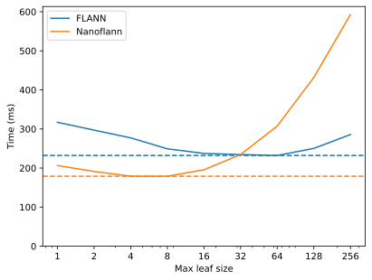
</a>
##### Multithreaded:
<a href="plots/nn-search/line/num_search_10000000_num_query_100000_k_1_mt.svg">
    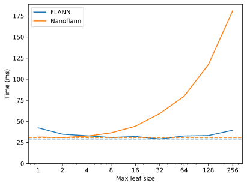
</a>
## Generation

### Page (with plots)

```bash
PYTHONPATH=. python generate.py -s "Intel Core i7 5820K" -c ../../configs/desktop/5820k.json -b ../../results/desktop/5820k -o ../../docs/setups/desktop/5820k
```

### Plots
```shell
PYTHONPATH=. python plots/build_tree.py -b ../../results/desktop/5820k/build_tree.csv
PYTHONPATH=. python plots/nn_search.py -b ../../results/desktop/5820k/nn_search.csv --draw-line-plots
```
