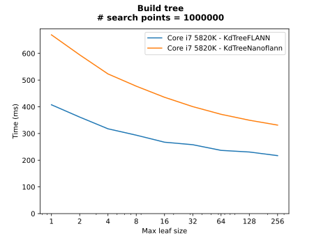

## Generation ##

```
python build_tree.py -b ../../results/desktop/5820k/build_tree.csv -s "Core i7 5820K" --do-not-show --output ../../setups/desktop/5820k/plots/build-tree
python nn_search.py -b ../../results/desktop/5820k/nn_search.csv -s "Core i7 5820K" --draw-line-plots --do-not-show --output ../../setups/desktop/5820k/plots/nn-search
```

## Benchmarks ##

### Build tree ###

[](plots/build-tree//num_search_100000.svg)
[](plots/build-tree//num_search_1000000.svg)

### NN search ###

[](plots/nn-search/line/num_search_10000_num_query_100000_k_1_st.svg)
[](plots/nn-search/line/num_search_10000_num_query_100000_k_1_mt.svg)

[](plots/nn-search/line/num_search_100000_num_query_100000_k_1_st.svg)
[](plots/nn-search/line/num_search_100000_num_query_100000_k_1_mt.svg)

[](plots/nn-search/line/num_search_1000000_num_query_100000_k_1_st.svg)
[](plots/nn-search/line/num_search_1000000_num_query_100000_k_1_mt.svg)

[](plots/nn-search/line/num_search_10000000_num_query_100000_k_1_st.svg)
[](plots/nn-search/line/num_search_10000000_num_query_100000_k_1_mt.svg)

#### Best max leaf size ####

[](plots/nn-search/bar/num_query_100000_k_1_st.svg)
[](plots/nn-search//bar/num_query_100000_k_1_mt.svg)
